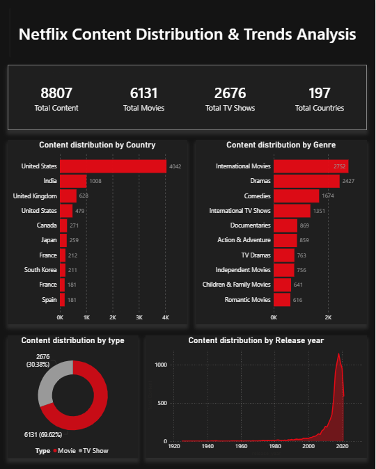
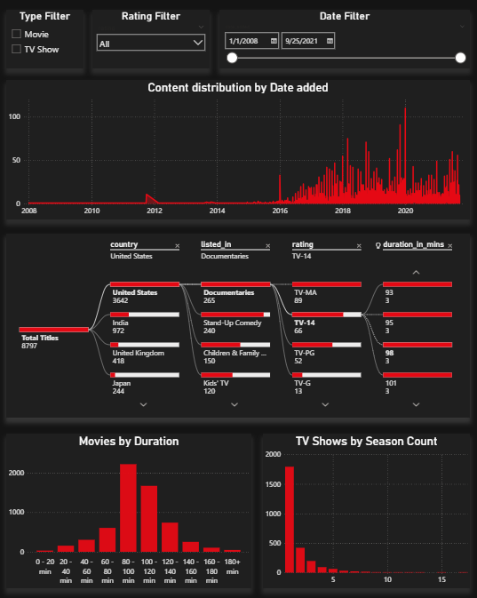

# Netflix Content Analysis Dashboard (Power BI)

## 📊 Overview
This project analyzes Netflix’s content catalog to understand distribution, trends, and content characteristics across movies and TV shows.

---

## 🎯 Objectives
- Analyze content distribution by country, genre, and type
- Identify growth trends over time
- Understand content structure (duration, season count)
- Provide insights for content strategy

---

## 🛠 Tools Used
- Power BI
- Power Query
- DAX

---

## 📁 Data Modeling
- Implemented a **star schema**
- Created separate mapping tables for:
  - Country
  - Genre (listed_in)
- Handled multi-value columns efficiently

---

## 📊 Key Insights

- Movies dominate the catalog (~70%), but TV shows are critical for engagement
- Majority of content is produced in the US, with growing contribution from India
- Content grew rapidly after 2015, indicating platform expansion
- Most movies fall in the 80–100 minute range
- Most TV shows have only 1–2 seasons

---

## 💡 Business Recommendations

- Increase investment in long-running TV series for retention
- Expand localized content in emerging markets
- Maintain consistent content release strategy
- Optimize movie duration based on audience preference

---

## 📸 Dashboard Preview

---

## 📂 Files Included
- `Netflix_Dashboard.pbix`
- Dataset (CSV/Excel)
- Screenshots

---

## 🚀 Outcome
This dashboard helps transform raw data into actionable insights for content strategy and decision-making.
